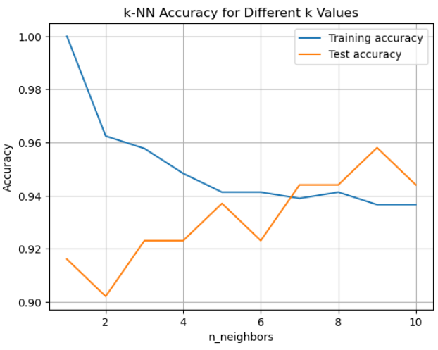

# 🧠 Breast Cancer Classifier - Machine Learning with k-NN


This project applies a **k-Nearest Neighbors (k-NN)** classifier to the **Breast Cancer Wisconsin Diagnostic Dataset** to predict whether a tumor is **malignant** or **benign**.

Built as part of **"Machine Learning"** assignment, this project focuses on:
- Data preprocessing and understanding
- Model training with `KNeighborsClassifier`
- Accuracy evaluation
- Hyperparameter tuning (`k` value)
- Visualization of training vs. test accuracy

---

## 📊 Accuracy Plot



---

## 🚀 How it Works

- **Input**: 30 real-valued features (e.g., mean radius, texture, perimeter, etc.)
- **Output**: Binary classification (0 = malignant, 1 = benign)

We split the dataset:
- 75% → Training
- 25% → Testing

Used Scikit-learn’s `KNeighborsClassifier` and evaluated model performance with `.score()`.

---

## 📁 Project Folder Structure

```bash
Breast-Cancer-Classifier/
├── Knn_Breast_Cancer_Classifier.ipynb     ✅ Your completed notebook
├── breast_cancer_data.csv                 ✅ Dataset in CSV format
├── knn_accuracy_plot.png                  ✅ Accuracy vs. k plot
├── README.md                              ✅ Project summary file
└── LICENSE                                ✅ MIT open source license
```

---

## 📁 Files

- `Knn_Breast_Cancer_Classifier.ipynb`: Full notebook with clean, commented code
- `knn_accuracy_plot.png`: Accuracy vs. k plot
- `README.md`: This file

---

## 🛠 Tech Stack

- Python 3.9
- Jupyter Notebook
- Scikit-learn
- Matplotlib
- Pandas

---

## ✅ Result

Achieved **~93% test accuracy** using k-NN with `k=8`.  
The plot reveals how different `k` values affect model performance and generalization.

---

## 📄 License

This project is licensed under the MIT License - see the [LICENSE](LICENSE) file for details.

---

## 📬 Connect

- 🔗 [LinkedIn](https://www.linkedin.com/in/mukeshthenraj)
- 📧 mukeshthenraj@gmail.com
